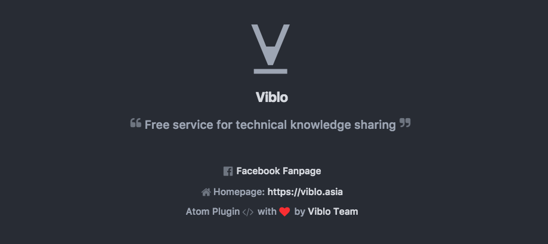

# Viblo Atom Plugin package



## Requirement
- [Atom](https://atom.io/) version 1.x

## Installation
- Open `Atom`
- Go the `Packages` > `Settings View` > `Open` or press <kbd>Ctrl + Shift + P</kbd>, in the search menu type the keywords **Install packages** and click **Settings View:Install Packages and Themes**.
- In the search bar type `viblo` and then install it :smile:

## Features
- Get Posts and Drafts list from Viblo
- Create a new post and save it as a draft or publish it
- Edit an existed draft or post
- Upload images to Viblo
- Markdown preview with Viblo's supported syntaxes

## Usage
### Setting
- Go to [Viblo Setting Page](https://viblo.asia/settings/oauth) to create an API key
- Press <kbd>Ctrl + Shift + P</kbd>, type `viblo`, then go to `Viblo: Settings` page. Paste your API key here
- Go to `Viblo: Posts` page to check your posts and draft

### Create new posts
- Create new file, then save it as a `markdown` file (with `.md` as file extension)
- Right click at atom, then choose `Viblo Preview` to review your post contents
- Right click at atom, then choose `Publish to Viblo` to start saving post contents to Viblo

### Edit a post or draft
- Go to `Viblo: Posts` page to check your posts and draft
- Click at the post or draft that you want to edit
- Start editing
- Press <kbd>Ctrl + S</kbd> to save it into Viblo

## Developing
1. Clone repository
```
cd ~/ & git clone git@github.com:framgia/viblo-atom-plugin.git
```
 to `~/.atom/packages` folder or make `symlink` inside this folder named `viblo`
```
ln -s ~/viblo-atom-plugin ~/.atom/packages/viblo
```

2. Press <kbd>Ctrl + Shift + P</kbd>, type the command `Window: reload` or just `reload` and press <kbd>Enter</kbd> to reload Atom workspace and after that `viblo` will be available in list of installed packages
3. Check that our package has beed installed, press <kbd>Ctrl + Shift + P</kbd>, type the command `Settings View: View Installed Packages` or just `Installed Packages` (command line have fuzzy autocomplete) and press <kbd>Enter</kbd>

> **Note:** To check your code need to reload Atom workspace each time

### Helpful links
- [Documentation of Atom](https://atom.io/docs)
- [Atom API](https://atom.io/docs/api/)
- [Specification of Versioning of package](http://semver.org/)

### Licence
[MIT](./LICENSE)
